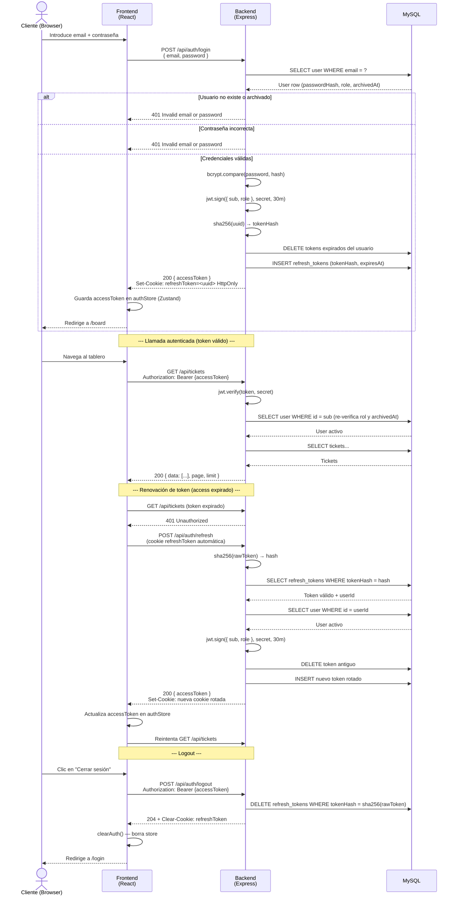
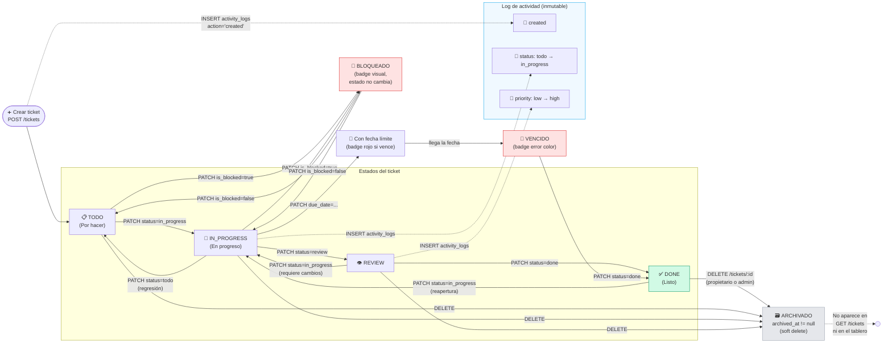

# Diagramas técnicos — Mini Jira

> Diagramas en sintaxis Mermaid válida. Renderizables en GitHub, GitLab, Notion y VS Code con la extensión Mermaid Preview.
>
> **Nota:** Los archivos `architecture.md` y `specs.md` de referencia indican un diseño con Last-Write-Wins (sin Pessimistic Lock en la implementación actual). Los diagramas reflejan el sistema tal como está implementado en el código fuente.

---

## 1. Flujo de autenticación JWT



---

## 2. Mover ticket entre columnas (drag & drop)

```mermaid
sequenceDiagram
    actor U as Usuario
    participant FE as Frontend<br/>(React + dnd-kit)
    participant OPT as useOptimistic<br/>(React 19)
    participant QUERY as TanStack Query
    participant API as Backend<br/>(Express)
    participant DB as MySQL
    participant SSE as SSE Clients<br/>(otros usuarios)

    U->>FE: Arrastra tarjeta de "Por hacer" a "En progreso"
    FE->>FE: handleDragEnd — detecta newStatus = 'in_progress'
    
    FE->>OPT: applyOptimistic({ id, status: 'in_progress' })
    OPT-->>FE: optimisticTickets con tarjeta movida (UI instantánea)

    FE->>QUERY: mutate({ id, status: 'in_progress' })
    QUERY->>API: PATCH /api/tickets/{id}<br/>Authorization: Bearer {token}<br/>{ "status": "in_progress" }

    API->>API: verifyToken + re-verifica user en DB
    API->>DB: SELECT ticket WHERE id = ? AND archived_at IS NULL
    
    alt Ticket no encontrado
        API-->>QUERY: 404 Not found
        OPT-->>FE: Revierte estado optimista (stale data)
    else Sin permisos (ni propietario ni admin)
        API-->>QUERY: 403 Forbidden
        OPT-->>FE: Revierte estado optimista
    else Autorizado
        API->>DB: UPDATE tickets SET status='in_progress', updated_at=NOW()
        API->>DB: INSERT activity_logs<br/>{ action:'updated', field:'status',<br/>  oldValue:'todo', newValue:'in_progress' }
        API->>DB: SELECT ticket + assignees + labels (getTicketWithRelations)
        DB-->>API: Ticket actualizado completo
        API->>SSE: broadcastBoardUpdate('ticket:updated', ticket)
        SSE-->>FE: Evento SSE → otros clientes reciben el cambio
        API-->>QUERY: 200 Ticket actualizado
        QUERY->>QUERY: invalidateQueries([TICKETS_KEY])
        QUERY->>API: GET /api/tickets (refresco background)
        API-->>QUERY: Lista actualizada
        QUERY-->>FE: Estado definitivo en pantalla
    end
```

---

## 3. Ciclo de vida de un ticket


